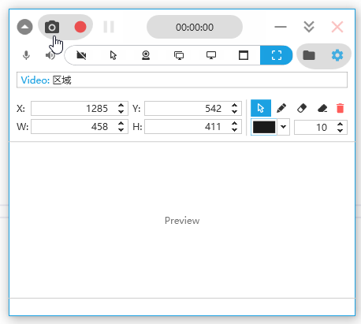
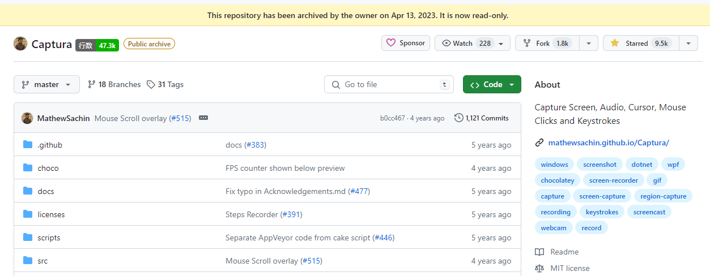

[](LICENSE.md)


---

## 中文说明

> Intel CPU + NVIDIA 显卡建议使用 `ffmpeg 4.4` 或 `6.1` 版本
> 如果全屏录制不生效，请在 设置 → 视频 中启用 GDI 替代进行录制（测试环境：AMD CPU + AMD 显卡）
> 修改 `thread_queue_size` 为 1024，记得勾选帧率限制（测试环境：ffmpeg 4.4）

### FFmpeg 下载来源

- https://github.com/BtbN/FFmpeg-Builds/releases
- https://github.com/GyanD/codexffmpeg/releases?q=4.4&expanded=true
- https://github.com/FFmpeg/FFmpeg/tree/release/4.4

### 版权声明

&copy; [Copyright 2019](mathew/LICENSE_MathewSachin.md) Mathew Sachin  
&copy; [Copyright 2024](LICENSE.md) Mr. Chip

### 项目简介

**nCaptura** 是一个 Windows 屏幕录制和截图应用程序，使用 C#/WPF 开发。

原项目 [Captura](https://github.com/MathewSachin/Captura) 由 **Mathew Sachin** 开发，后因作者转向其他兴趣而停止维护。本项目 fork 自原项目，继续进行维护和改进。

**nCaptura** 意为 `new-Captura`，希望为这个项目开启新的旅程。

### 功能特性

- 屏幕截图
- 屏幕录制（支持 AVI/GIF/MP4 格式）
- 摄像头捕获
- 麦克风和扬声器音频录制
- 鼠标点击和按键记录
- 区域/全屏/窗口选择录制
- 热键配置
- Imgur/YouTube 上传
- 命令行支持
- 多语言支持

### 安装

安装包即将推出。

如需安装原版 `Captura`，请访问 [原项目发布页](https://github.com/MathewSachin/Captura/releases/latest)。

#### Chocolatey

```powershell
choco install captura -y
```

### 构建

详细构建说明请参阅 [构建文档](docs/Build.md)。

**前置要求：**
- Visual Studio 2019+ with .NET desktop development workload
- .NET Core 2.1 SDK 或更高版本
- Cake 工具: `dotnet tool install -g Cake.Tool --version 0.32.1`

**构建命令：**

```bash
# 使用 Cake 构建
dotnet cake

# 仅构建项目
dotnet cake --target=Build

# 运行测试
dotnet cake --target=Test
```

### 文档

- [构建说明](docs/Build.md)
- [系统要求](docs/System-Requirements.md)
- [贡献指南](CONTRIBUTING.md)
- [命令行使用](docs/Cmdline/README.md)
- [FAQ](docs/FAQ.md)
- [FFmpeg 配置](docs/FFmpeg.md)
- [更新日志](docs/Changelogs/README.md)

### 许可证

[MIT License](LICENSE.md)

依赖库许可证请查看 [licenses/](licenses/) 目录。

---

## English

> Intel CPU + NVIDIA GPU recommended with `ffmpeg 4.4` or `6.1`
> If fullscreen recording doesn't work, enable GDI fallback in Settings → Video (tested on AMD CPU + AMD GPU)
> Set `thread_queue_size` to 1024 and enable frame rate limit (tested with ffmpeg 4.4)

### FFmpeg Sources

- https://github.com/BtbN/FFmpeg-Builds/releases
- https://github.com/GyanD/codexffmpeg/releases?q=4.4&expanded=true
- https://github.com/FFmpeg/FFmpeg/tree/release/4.4

### Copyright

&copy; [Copyright 2019](mathew/LICENSE_MathewSachin.md) Mathew Sachin  
&copy; [Copyright 2024](LICENSE.md) Mr. Chip

Learn more about the original **Captura** project at:  
:link: <https://mathewsachin.github.io/Captura/>

Capture Screen, WebCam, Audio, Cursor, Mouse Clicks and Keystrokes.



I learned about **Captura** from a chat room. [Captura](https://github.com/MathewSachin/Captura) was an open source project originally developed by **Mathew Sachin**. The author eventually discontinued development due to unpleasant experiences ([#406](https://github.com/MathewSachin/Captura/issues/405)) and shifting interests ([#570](https://github.com/MathewSachin/Captura/issues/570)).



Looking at the GitHub code stats, the entire repository has less than **50k** lines of code. In the spirit of learning, I cloned this repository and found it compiles directly on Visual Studio 2022, which is very nice. During this period, I also found some bugs. This is a good software, and it's a pity it was discontinued. So I decided to take over the maintenance of this software and created a fork [mrchipset/nCaptura](https://github.com/mrchipset/nCaptura) to start my modifications.

I renamed the repository to **nCaptura**, meaning `new-Captura`. Hopefully, it will lead to a new journey for this project.

### Features

- Take ScreenShots
- Capture ScreenCasts (Avi/Gif/Mp4)
- Capture with/without Mouse Cursor
- Capture Specific Regions, Screens or Windows
- Capture Mouse Clicks or Keystrokes
- Mix Audio recorded from Microphone and Speaker Output
- Capture from WebCam
- Command-line support (*BETA*)
- Multiple languages support
- Configurable Hotkeys

### Installation

Installation package for `nCaptura` is coming soon.

To install the original `Captura`, please visit [releases page](https://github.com/MathewSachin/Captura/releases/latest).

#### Chocolatey

```powershell
choco install captura -y
```

#### Dev Builds

See [Continuous Integration page](docs/CI.md).

### Build

For detailed build instructions, see [Build Notes](docs/Build.md).

**Prerequisites:**
- Visual Studio 2019+ with .NET desktop development workload
- .NET Core 2.1 SDK or higher
- Cake tool: `dotnet tool install -g Cake.Tool --version 0.32.1`

**Build Commands:**

```bash
# Build with Cake
dotnet cake

# Build only
dotnet cake --target=Build

# Run tests
dotnet cake --target=Test
```

### Documentation

- [Build Notes](docs/Build.md)
- [System Requirements](docs/System-Requirements.md)
- [Contributing](CONTRIBUTING.md)
- [ScreenShots](docs/Screenshots)
- [Command-line](docs/Cmdline/README.md)
- [Hotkeys](https://mathewsachin.github.io/Captura/hotkeys)
- [FAQ](docs/FAQ.md)
- [Code of Conduct](CODE_OF_CONDUCT.md)
- [Changelog](docs/Changelogs/README.md)
- [Continuous Integration](docs/CI.md)
- [FFmpeg](docs/FFmpeg.md)

### License

[MIT License](LICENSE.md)

Check [licenses/](licenses/) for licenses of dependencies.